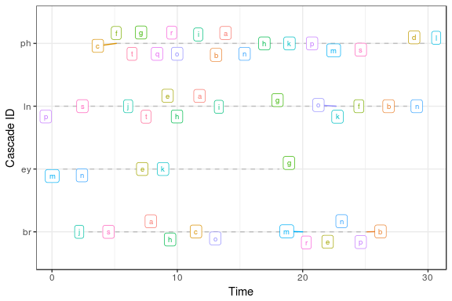
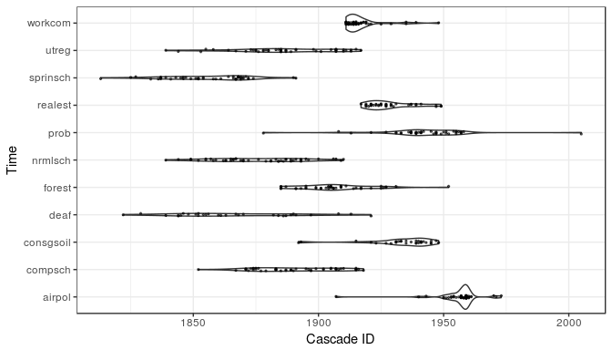
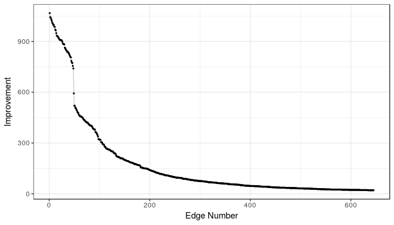
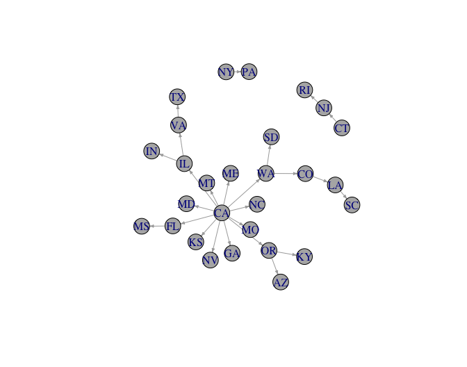

NetworkInference: Inferring Latent Diffusion Networks
================
Fridolin Linder
2017-02-22


Introduction
------------

This package provides an R implementation of the netinf algorithm created by Gomez Rodriguez, Leskovec, and Krause (2010). Given a set of events that spread between a set of nodes the algorithm infers the most likely stable diffusion network that is underlying the diffusion process.

Installation
------------

The package can be installed from github:

``` r
#install.packages("devtools")
devtools::install_github("flinder/NetworkInference")
```

Quick start guide
-----------------

To get started get your data into the `cascades` format required by the `netinf` function:

``` r
library(NetworkInference)

# Simulate random cascade data
df <- simulate_rnd_cascades(50, n_node = 20)
node_names <- unique(df$node_name)

# Cast data into `cascades` object
## From dataframe
cascades <- as.cascade(df, node_names = node_names)

## From matrix
df_matrix <- as.matrix(cascades) ### Create example matrix
cascades <- as.cascade(df_matrix, node_names = node_names)
```

Then fit the model:

``` r
result <- netinf(cascades, trans_mod = "exponential", lambda = 1, n_edges = 5)
```

``` r
print(result)
```

<table style="width:64%;">
<colgroup>
<col width="19%" />
<col width="26%" />
<col width="18%" />
</colgroup>
<thead>
<tr class="header">
<th align="center">origin_node</th>
<th align="center">destination_node</th>
<th align="center">improvement</th>
</tr>
</thead>
<tbody>
<tr class="odd">
<td align="center">o</td>
<td align="center">t</td>
<td align="center">182.5</td>
</tr>
<tr class="even">
<td align="center">i</td>
<td align="center">x</td>
<td align="center">136</td>
</tr>
<tr class="odd">
<td align="center">o</td>
<td align="center">w</td>
<td align="center">133.5</td>
</tr>
<tr class="even">
<td align="center">a</td>
<td align="center">z</td>
<td align="center">128.5</td>
</tr>
<tr class="odd">
<td align="center">s</td>
<td align="center">m</td>
<td align="center">123.8</td>
</tr>
</tbody>
</table>

Tutorial
--------

This is a quick tutorial to get started with the package. For more detailed information on the algorithm and functionality of the package see the package documentation.

`netinf` infers the optimal diffusion network from a set of *nodes* and a number of so called *cascades*. A cascade is a series of events occurring at a specified time. For this demo we will replicate the analysis presented in Desmarais, Harden, and Boehmke (2015). In this paper Desmarais et al. infer a latent network for policy diffusion based on adoption of 187 policies in the US states. In this case a node in the network is a state, a cascade refers to a specific policy and an event is the adoption of said policy in a state.

### Preparing the Data

The data for Desmarais, Harden, and Boehmke (2015) is available in the package:

``` r
library(NetworkInference)
# Load the `policies` dataset (?policies for details).
data(policies)
state_names <- rownames(policies)
```

In this case the data is stored in a matrix. Each row corresponds to a state and each column corresponds to a policy. The cell entries indicate the year a state adopted a policy (or `NA` in case the policy was never adopted). Let's look at the upper left corner of this matrix:

``` r
policies[1:7, 1:7]
```

<table>
<colgroup>
<col width="11%" />
<col width="14%" />
<col width="15%" />
<col width="9%" />
<col width="9%" />
<col width="15%" />
<col width="11%" />
<col width="11%" />
</colgroup>
<thead>
<tr class="header">
<th align="center"> </th>
<th align="center">equalpay</th>
<th align="center">conacchwy</th>
<th align="center">soil</th>
<th align="center">fish</th>
<th align="center">consgsoil</th>
<th align="center">airpol</th>
<th align="center">forest</th>
</tr>
</thead>
<tbody>
<tr class="odd">
<td align="center"><strong>CT</strong></td>
<td align="center">1949</td>
<td align="center">1939</td>
<td align="center">1945</td>
<td align="center">1867</td>
<td align="center">NA</td>
<td align="center">1959</td>
<td align="center">1901</td>
</tr>
<tr class="even">
<td align="center"><strong>ME</strong></td>
<td align="center">1949</td>
<td align="center">1939</td>
<td align="center">1941</td>
<td align="center">1878</td>
<td align="center">NA</td>
<td align="center">1954</td>
<td align="center">1891</td>
</tr>
<tr class="odd">
<td align="center"><strong>MA</strong></td>
<td align="center">1945</td>
<td align="center">1943</td>
<td align="center">1945</td>
<td align="center">1865</td>
<td align="center">NA</td>
<td align="center">1954</td>
<td align="center">1904</td>
</tr>
<tr class="even">
<td align="center"><strong>NH</strong></td>
<td align="center">1947</td>
<td align="center">1943</td>
<td align="center">1945</td>
<td align="center">1864</td>
<td align="center">NA</td>
<td align="center">1955</td>
<td align="center">1893</td>
</tr>
<tr class="odd">
<td align="center"><strong>RI</strong></td>
<td align="center">1946</td>
<td align="center">1937</td>
<td align="center">1943</td>
<td align="center">1879</td>
<td align="center">NA</td>
<td align="center">1956</td>
<td align="center">1909</td>
</tr>
<tr class="even">
<td align="center"><strong>VT</strong></td>
<td align="center">NA</td>
<td align="center">1955</td>
<td align="center">1939</td>
<td align="center">1867</td>
<td align="center">NA</td>
<td align="center">1959</td>
<td align="center">1904</td>
</tr>
</tbody>
</table>

Most functionality of the `NetworkInference` package is based on the `cascades` data format. So before starting with the analysis we have to transform our dataframe to such an object (other formats for the input data, such as matrices, are supported, too.

``` r
policy_cascades <- as.cascade(policies, node_names = state_names)
```

The `cascades` data type is basically a list containing all the data stored in three separate objects.

### Visually Inspecting Cascades

It's always good practice to visually inspect the data before working with it. The `NetworkInference` package provides functionality to visualize the cascade data.

The function `summary.cascades()` provides quick summary statistics on the cascade data:

``` r
summary(policy_cascades)
```

    ## # cascades: 187
    ## # nodes: 50
    ## # nodes in cascades: 50
    ## # possible edges: 2450
    ## 
    ## Summary statistics for node length and ties:
    ##         length  ties
    ## Min.     10.00  1.00
    ## 1st Qu.  23.00 11.00
    ## Median   33.00 19.00
    ## Mean     33.13 20.18
    ## 3rd Qu.  46.00 29.00
    ## Max.     50.00 45.00

The first four lines provide the number of cascades, the number of nodes in the system, the number of nodes involved in cascades (there might be states that we don't have diffusion data on, but we still want them represented in the dataset) and the possible number of edges in a potential diffusion network (a diffusion edge between nodes `u` and `v` only makes sense if there is at least one cascade in which `u` experiences an event before `v`). In this example there are 187 policies and 50 states. Each state is involved in at least one policy cascade and a fully connected diffusion network would have 2450 edges.

It also provides summary statistics on the distribution of the cascade lengths (number of nodes involved in each cascade) and the number of ties in the cascades (two nodes experiencing the same event at the same time). For our example, we can see that the 'smallest' policy was adopted by 10 states and the 'largest' by all 50 states. From the tie summaries we see that there is at least one policy that was adopted by 45 states in the same year.

The `plot()` method allows to plot cascades with varying degrees of detail. The argument `label_nodes` (`TRUE/FALSE`) provides node labels which require more space but provide more detail. The argument `selection` allows to pick a subset of cascades to visualize in case there are too many to plot. If `label_nodes` is set to `FALSE` each event is depicted by a dot, which allows to visualize more cascades simultaneously.

Let's first look at the visualization with labels. Here we plot four cascades, selected by their name:

``` r
cascade_ids <- colnames(policies)
selection <- cascade_ids[c(16, 186)]
plot(policy_cascades, label_nodes = TRUE, selection = selection)
```



We can also plot more cascades with less detail:

``` r
selection <- cascade_ids[5:15]
plot(policy_cascades, label_nodes = FALSE, selection = selection)
```



This produces a ['violin plot'](https://en.wikipedia.org/wiki/Violin_plot) for each cascade with the single diffusion events overplotted as dots. As we already saw in the previous visualization, the policy data has a lot of ties (i.e. many states adopted a policy in the same year) which is indicated by the areas of higher density in the violin plot.

### Inferring the Latent Diffusion Network

The `netinf` algorithm is implemented in the `netinf()` function. Besides the data, the function takes three parameters.

`trans_mod` specifies the transition model, or the parametric model according to which the times between diffusion events are distributed. Currently two distributions are available, the exponential and the Rayleigh distribution. For this example we choose the exponential density.

`lambda` is the scale parameter for the respective distribution.

`n_edges` specifies how many edges should be inferred. Best practice is to choose a high number of edges first and then look for a drop-off in gained model fit for each added edge. Then we can rerun the algorithm with a lower number of edges. See Gomez Rodriguez, Leskovec, and Krause (2010) and Desmarais, Harden, and Boehmke (2015) for guidance on choosing this parameter. The number of inferred edges has to be lower than the maximum number of possible edges. An edge `u->v` is only possible if in at least one cascade `u` experiences an event *before* `v`. This means, that the maximum number of edges depends on the data. The function `count_possible_edges()` allows us to compute the maximum number of edges in advance:

``` r
npe <- count_possible_edges(cascades)
npe
```

    ## [1] 644

Let's run the algorithm with the maximum number of edges to see where the improvement drops off significantly:

``` r
results <- netinf(policy_cascades, trans_mod = "exponential", n_edges = npe, 
                  lambda = 1)
```

Let's take a look at the output of the algorithm. The output is a dataframe containing the inferred latent network in the form of an edgelist:

``` r
head(results)
```

<table style="width:64%;">
<colgroup>
<col width="19%" />
<col width="26%" />
<col width="18%" />
</colgroup>
<thead>
<tr class="header">
<th align="center">origin_node</th>
<th align="center">destination_node</th>
<th align="center">improvement</th>
</tr>
</thead>
<tbody>
<tr class="odd">
<td align="center">VA</td>
<td align="center">TX</td>
<td align="center">1067</td>
</tr>
<tr class="even">
<td align="center">CA</td>
<td align="center">NC</td>
<td align="center">1043</td>
</tr>
<tr class="odd">
<td align="center">CA</td>
<td align="center">IL</td>
<td align="center">1040</td>
</tr>
<tr class="even">
<td align="center">OR</td>
<td align="center">KY</td>
<td align="center">1031</td>
</tr>
<tr class="odd">
<td align="center">WA</td>
<td align="center">CO</td>
<td align="center">1022</td>
</tr>
<tr class="even">
<td align="center">CA</td>
<td align="center">MD</td>
<td align="center">1011</td>
</tr>
</tbody>
</table>

Each row corresponds to a directed edge. The first column indicates the origin node, the second the destination node. The third column displays the gain in model fit from each added edge. Note that the best fitting network would be a fully connected graph, i.e. a diffusion edge between all nodes. However, since we want to infer a sparse network, a model that captures the important diffusion pathways we need to regularize by constraining the number of edges in the network. In order to find a good cutoff, it is good to visualize the gain to check if we can find a sudden drop-off. There is a generic plot method to inspect the results. If more tweaking is required, the results are a dataframe so it should be easy for the more experienced users to make your own plot. With `type = "improvement"` the improvement from each edge can be plotted.

``` r
plot(results, type = "improvement")
```



After inspecting the improvements, the model can be re-run with the desired number of edges. We choose (arbitrarily) 25 here:

``` r
diffusion_network <- netinf(policy_cascades, trans_mod = "exponential", 
                            n_edges = 25, lambda = 1)
```

In order to produce a quick visualization of the resulting diffusion network we can use the plot method again, this time with `type = "network"`. Note that in order to use this functionality the igraph package has to be installed.

``` r
#install.packages('igraph')
plot(diffusion_network, type = "network")
```



If additional tweaking of the plot is desired, the network can be visualized using `igraph` explicitly. We refer you you to the [igraph documentation](https://cran.r-project.org/web/packages/igraph/igraph.pdf) for details on how to customize the plot.

``` r
library(igraph)
g <- graph_from_data_frame(d = results[, 1:2])
plot(g, edge.arrow.size=.3, vertex.color = "grey70")
```

References
----------

Desmarais, Bruce A, Jeffrey J Harden, and Frederick J Boehmke. 2015. “Persistent Policy Pathways: Inferring Diffusion Networks in the American States.” *American Political Science Review* 109 (02). Cambridge Univ Press: 392–406.

Gomez Rodriguez, Manuel, Jure Leskovec, and Andreas Krause. 2010. “Inferring Networks of Diffusion and Influence.” In *Proceedings of the 16th Acm Sigkdd International Conference on Knowledge Discovery and Data Mining*, 1019–28. ACM.
