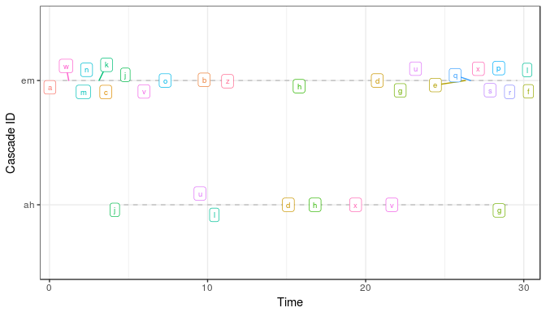
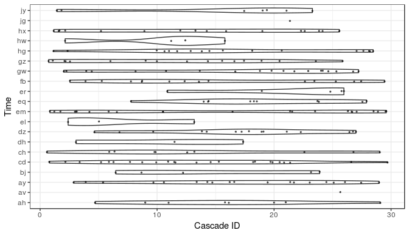
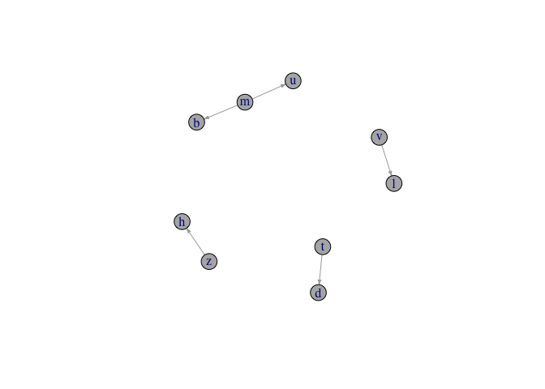
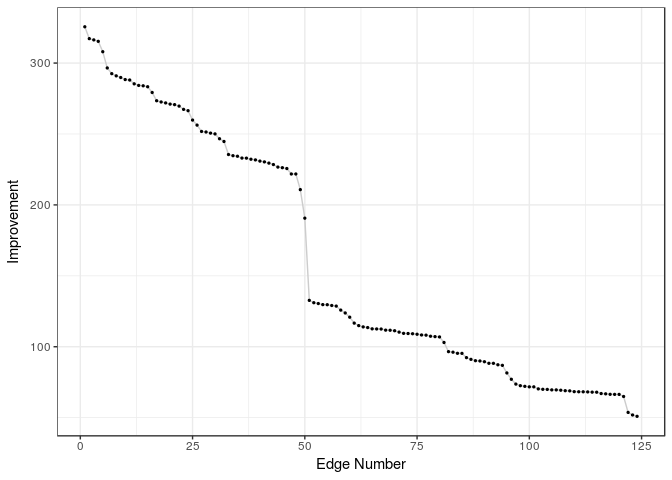

<!-- README.md is generated from README.Rmd. Please edit that file -->
NetworkInference: Inferring Latent Diffusion Networks
=====================================================

 


About
-----

This package provides an R implementation of the netinf algorithm created by Gomez-Rodriguez, Leskovec, and Krause (see [here](http://snap.stanford.edu/netinf/) for more information and the original C++ implementation). Given a set of events that spread between a set of nodes the algorithm infers the most likely stable diffusion network that is underlying the diffusion process.

Installation
------------

The package can be installed from [CRAN](https://CRAN.R-project.org/):

``` r
install.packages("NetworkInference")
```

The latest development version can be installed from [github](https://github.com/desmarais-lab/NetworkInference):

``` r
#install.packages(devtools)
devtools::install_github('desmarais-lab/NetworkInference')
```

Quick start guide
-----------------

This gets you started. For more in-depth explanations see the package vignette and documentation.

First, get your data into the `cascades` format required by the `netinf` function:

``` r
library(NetworkInference)

# Simulate random cascade data
set.seed(423399)
df <- simulate_rnd_cascades(50, n_node = 26) # Simulates random cascade data
node_names <- unique(df$node_name)

# Cast data into `cascades` object
## From dataframe
cascades <- as.cascade(df, node_names = node_names)

## From matrix
df_matrix <- as.matrix(cascades) ### Create example matrix
cascades <- as.cascade(df_matrix, node_names = node_names)
```

Cascades can be explored using `summary` and `plot`. See the vignette and package documentation for full functionality.

``` r
cascade_ids <- names(cascades[[1]])
selection <- cascade_ids[c(1, 10)]
plot(cascades, label_nodes = TRUE, selection = selection)
```



``` r
selection <- cascade_ids[c(1:20)]
plot(cascades, label_nodes = FALSE, selection = selection)
```



The actual netinf algorithm is used with:

``` r
result <- netinf(cascades, trans_mod = "exponential", lambda = 1, n_edges = 5)
```

The resulting network comes in form of an edgelist:

``` r
print(result)
```

<table style="width:64%;">
<colgroup>
<col width="19%" />
<col width="26%" />
<col width="18%" />
</colgroup>
<thead>
<tr class="header">
<th align="center">origin_node</th>
<th align="center">destination_node</th>
<th align="center">improvement</th>
</tr>
</thead>
<tbody>
<tr class="odd">
<td align="center">z</td>
<td align="center">h</td>
<td align="center">213.1</td>
</tr>
<tr class="even">
<td align="center">m</td>
<td align="center">b</td>
<td align="center">207.6</td>
</tr>
<tr class="odd">
<td align="center">v</td>
<td align="center">l</td>
<td align="center">192.8</td>
</tr>
<tr class="even">
<td align="center">t</td>
<td align="center">d</td>
<td align="center">188.8</td>
</tr>
<tr class="odd">
<td align="center">m</td>
<td align="center">u</td>
<td align="center">182.7</td>
</tr>
</tbody>
</table>

The network as well as the improvement in fit by each edge can be visualized:

``` r
plot(result, type = "network")
```



``` r
plot(result, type = "improvement")
```


