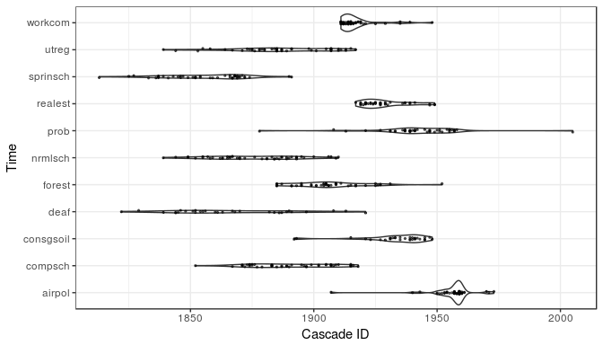
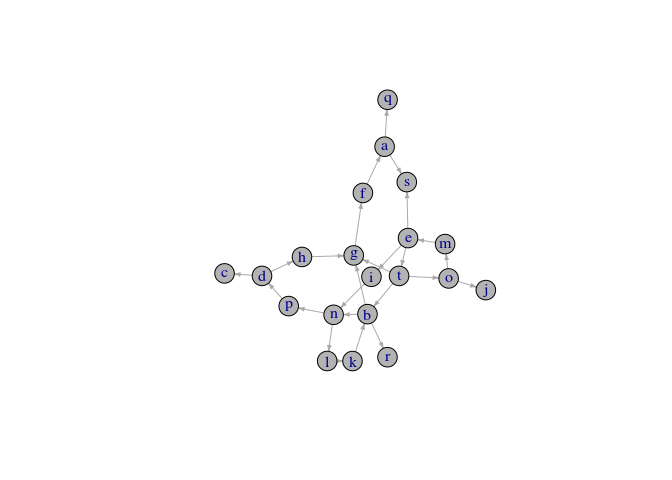

NetworkInference
================
Fridolin Linder
2017-01-19

Introduction
------------

The `NetworkInference` package provides an R implementation of the `netinf` algorithm (Gomez Rodriguez, Leskovec, and Krause 2010).

Quick start guide
-----------------

TL;DR: To get started get your data into the `cascades` format required by the `netinf` function:

``` r
library(NetworkInference)

# Simulate example data
df <- simulate_cascades(10)
node_names <- unique(df$node_name)

# Cast data into `cascades` object
## From dataframe
cascades <- as.cascade(df, node_names = node_names)

## From matrix
df_matrix <- as.matrix(cascades) ### Create example matrix
cascades <- as.cascade(df_matrix, node_names = node_names)
```

Then fit the model:

``` r
result <- netinf(cascades, trans_mod = "exponential", lambda = 1, n_edges = 5)
pander::pandoc.table(result)
```

<table style="width:64%;">
<colgroup>
<col width="19%" />
<col width="26%" />
<col width="18%" />
</colgroup>
<thead>
<tr class="header">
<th align="center">origin_node</th>
<th align="center">destination_node</th>
<th align="center">improvement</th>
</tr>
</thead>
<tbody>
<tr class="odd">
<td align="center">g</td>
<td align="center">i</td>
<td align="center">98.98</td>
</tr>
<tr class="even">
<td align="center">g</td>
<td align="center">d</td>
<td align="center">93.67</td>
</tr>
<tr class="odd">
<td align="center">g</td>
<td align="center">a</td>
<td align="center">83.94</td>
</tr>
<tr class="even">
<td align="center">i</td>
<td align="center">q</td>
<td align="center">76.89</td>
</tr>
<tr class="odd">
<td align="center">i</td>
<td align="center">t</td>
<td align="center">66.28</td>
</tr>
</tbody>
</table>

Tutorial
--------

This is a quick tutorial to get started with the package. For more detailed information on the algorithm and functionality of the package see below in this document and the official package documentation.

`netinf` infers the optimal diffusion network from a set of **nodes** and a number of so called **cascades**. A cascade is a series of events occurring at a specified time. For this demo we will replicate the analysis presented in (Desmarais, Harden, and Boehmke 2015). In this paper Desmarais et al. infer a latent network for policy diffusion based on adoption of 187 policies in the US states. In this case a node in the network is a state, a cascade refers to a specific policy and an event is the adoption of said policy in a state.

### Preparing the Data

The data for (Desmarais, Harden, and Boehmke 2015) is available in the package. Let's load it:

``` r
library(NetworkInference)
set.seed(9588)
policies <- simulate_cascades(100)
state_names <- unique(policies$node_name)
```

In this case the data is in the shape of a dataframe. Each row corresponds to an event, i.e. the adoption of a policy (`colname_policy`) by a state (`colname_state`) at a certain time (`colname_time`):

``` r
head(policies)
```

<table style="width:53%;">
<colgroup>
<col width="16%" />
<col width="18%" />
<col width="18%" />
</colgroup>
<thead>
<tr class="header">
<th align="center">node_name</th>
<th align="center">event_time</th>
<th align="center">cascade_id</th>
</tr>
</thead>
<tbody>
<tr class="odd">
<td align="center">n</td>
<td align="center">28.33</td>
<td align="center">ln</td>
</tr>
<tr class="even">
<td align="center">b</td>
<td align="center">27.62</td>
<td align="center">ln</td>
</tr>
<tr class="odd">
<td align="center">f</td>
<td align="center">23.72</td>
<td align="center">ln</td>
</tr>
<tr class="even">
<td align="center">k</td>
<td align="center">23.18</td>
<td align="center">ln</td>
</tr>
<tr class="odd">
<td align="center">o</td>
<td align="center">22.67</td>
<td align="center">ln</td>
</tr>
<tr class="even">
<td align="center">g</td>
<td align="center">17.22</td>
<td align="center">ln</td>
</tr>
</tbody>
</table>

Most functionality of the `NetworkInference` package is based on the `cascades` data format. So before starting with the analysis we have to transform our dataframe to such an object (other formats for the input data, such as matrices, are supported, too. See the section on data manipulation below for more details).

``` r
policy_cascades <- as.cascade(policies, node_names = state_names)
```

The `cascades` data type is basically a list containing all the data stored in three separate objects:

``` r
names(policy_cascades)
```

    ## [1] "cascade_nodes" "cascade_times" "node_names"

`cascade_nodes` contains one vector per cascade containing the node ids (state names) in the order of the event occurring for the node. Each vector is named by the cascade id (policy names):

``` r
policy_cascades$cascade_nodes[1:2]
```

    ## $ag
    ##  [1] "l" "b" "s" "k" "d" "c" "h" "i" "r" "e" "a" "j" "m"
    ## 
    ## $ap
    ##  [1] "r" "l" "p" "d" "t" "o" "q" "e" "m" "h" "f" "b" "a"

`cascade_times` is a list of vectors containing the event times again in the same order as the elements of `cascade_nodes`.

``` r
policy_cascades$cascade_times[1:2]
```

    ## $ag
    ##  [1]  1.419406  2.085201  2.950420  4.178073  7.039512  8.415287  8.776330
    ##  [8] 10.440150 10.590096 15.491325 16.276705 18.016922 29.417519
    ## 
    ## $ap
    ##  [1]  1.480406  6.163129  7.318833  7.451092  7.540415 10.434559 10.867154
    ##  [8] 12.307876 15.610419 19.207475 19.331478 22.505125 29.307230

Finally `node_names` contains the unique names of nodes (in our case states) in the system.

``` r
node_names[1:10]
```

    ##  [1] "a" "j" "f" "t" "s" "i" "n" "r" "m" "p"

### Plotting Cascades

It's always good practice to visually inspect the data before working with it. The `NetworkInference` package provides functionality to visualize the cascade data.

The `plot()` method allows to plot cascades with varying degrees of detail. The argument `label_nodes` (`TRUE/FALSE`) provides node labels which require more space but provide more detail. The argument `selection` allows to pick a subset of cascades to visualize in case there are too many to plot. If `label_nodes` is set to `FALSE` each event is depicted by a dot, which allows to visualize more cascades simultaneously.

Let's first look at the visualization with labels. Here we plot four cascades, selected by their name:

``` r
cascade_ids <- unique(policies$cascade_id)
selection <- cascade_ids[1:4]
plot(policy_cascades, label_nodes = TRUE, selection = selection)
```


We can also plot more cascades with less detail:

``` r
selection <- cascade_ids[1:30]
plot(policy_cascades, label_nodes = FALSE, selection = selection)
```


### Inferring the Latent Diffusion Network

The `netinf` algorithm is implemented in the `netinf()` function. Besides the data, the function takes three parameters.

`trans_mod` specifies the transition model, or the parametric model according to which the times between diffusion events are distributed. Currently two distributions are available, the exponential and the Rayleigh distribution. For this example we choose the exponential density.

`lambda` is the scale parameter for the respective distribution.

`n_edges` specifies how many edges should be inferred. Best practice is to choose a high number of edges first and then look for a drop-off in gained model fit for each added edge. Then we can rerun the algorithm with a lower number of edges. See Gomez Rodriguez, Leskovec, and Krause (2010) and Desmarais, Harden, and Boehmke (2015) for guidance on choosing this parameter.

``` r
results <- netinf(policy_cascades, trans_mod = "exponential", n_edges = 200, 
                  lambda = 1)
```

Let's take a look at the output of the algorithm. The output is a dataframe containing the inferred latent network in the form of an edgelist:

``` r
head(results)
```

<table style="width:64%;">
<colgroup>
<col width="19%" />
<col width="26%" />
<col width="18%" />
</colgroup>
<thead>
<tr class="header">
<th align="center">origin_node</th>
<th align="center">destination_node</th>
<th align="center">improvement</th>
</tr>
</thead>
<tbody>
<tr class="odd">
<td align="center">g</td>
<td align="center">f</td>
<td align="center">358.9</td>
</tr>
<tr class="even">
<td align="center">m</td>
<td align="center">e</td>
<td align="center">356.4</td>
</tr>
<tr class="odd">
<td align="center">t</td>
<td align="center">g</td>
<td align="center">355.2</td>
</tr>
<tr class="even">
<td align="center">e</td>
<td align="center">s</td>
<td align="center">343.7</td>
</tr>
<tr class="odd">
<td align="center">i</td>
<td align="center">n</td>
<td align="center">342.4</td>
</tr>
<tr class="even">
<td align="center">e</td>
<td align="center">i</td>
<td align="center">332.5</td>
</tr>
</tbody>
</table>

Each row corresponds to a directed edge. The first column indicates the origin node, the second the destination node. The third column displays the gain in model fit from each added edge. Note that the best fitting network would be a fully connected graph, i.e. a diffusion edge between all nodes. However, since we want to infer a sparse network, a model that captures the important diffusion pathways we need to regularize by constraining the number of edges in the network. In order to find a good cutoff, it is good to visualize the gain to check if we can find a sudden drop-off. There is a generic plot method to inspect the results. If more tweaking is required, the results are a dataframe so it should be easy for the more experienced users to make your own plot. With `type = "improvement"` the improvement from each can be plotted.

``` r
plot(results, type = "improvement")
```



In the plot we can see a kink in the plot at about edge \#25. Let's re-run `netinf` to get the final network.

``` r
diffusion_network <- netinf(policy_cascades, trans_mod = "exponential", 
                            n_edges = 25, lambda = 1)
```

In order to produce a quick visualization of the resulting diffusion network we can use the plot method again, this time with `type = "network"`. Note that in order to use this functionality the igraph package has to be installed.

``` r
#install.packages('igraph')
plot(diffusion_network, type = "network")
```



If additional tweaking of the plot is desired, the network can be visualized using `igraph` explicitly. We refer you you to the [igraph documentation](https://cran.r-project.org/web/packages/igraph/igraph.pdf) for details on how to customize the plot.

``` r
library(igraph)
g <- graph_from_data_frame(d = results[, 1:2])
plot(g, edge.arrow.size=.3, vertex.color = "grey70")
```


References
----------

Desmarais, Bruce A, Jeffrey J Harden, and Frederick J Boehmke. 2015. “Persistent Policy Pathways: Inferring Diffusion Networks in the American States.” *American Political Science Review* 109 (02). Cambridge Univ Press: 392–406.

Gomez Rodriguez, Manuel, Jure Leskovec, and Andreas Krause. 2010. “Inferring Networks of Diffusion and Influence.” In *Proceedings of the 16th Acm Sigkdd International Conference on Knowledge Discovery and Data Mining*, 1019–28. ACM.
